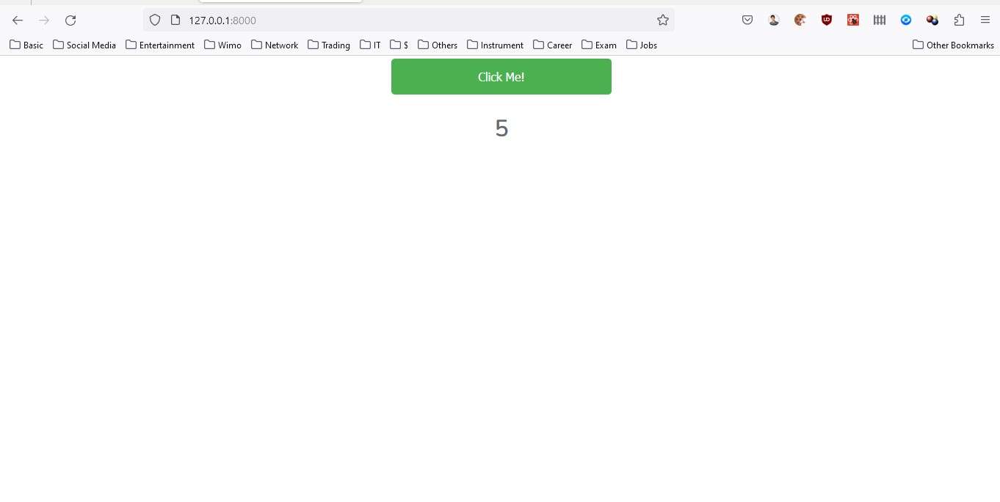

## Laravel 6 , React 16.2.0, PostgreSQL

Please follow the guide.

### Setup and Installation

1. `git clone`
2. `create a .env file copy content from .env.example and update the values`
3. `composer install`
4. `php artisan migrate:fresh --seed`
5. `npm install && npm run dev`
6. `php artisan key:generate`
7. `php artisan serve`
8. `npm run watch`

open browser and check the following address

`http://127.0.0.1:8000`

TODO:

- [x] Commit from your start time noting “START” in the commit description
- [x] Commit from your finish time noting “FINISH” in the commit description
- [x] Commits showing the growth of the codebase (i.e not one final commit) with appropriate
descriptions
- [x] Seeders and migration files
- [x] Readme documentation
- [x] Models and relationship definitions (in Eloquent)
- [ ] At least one unit test for one of the functionalities

## App Screenshots

